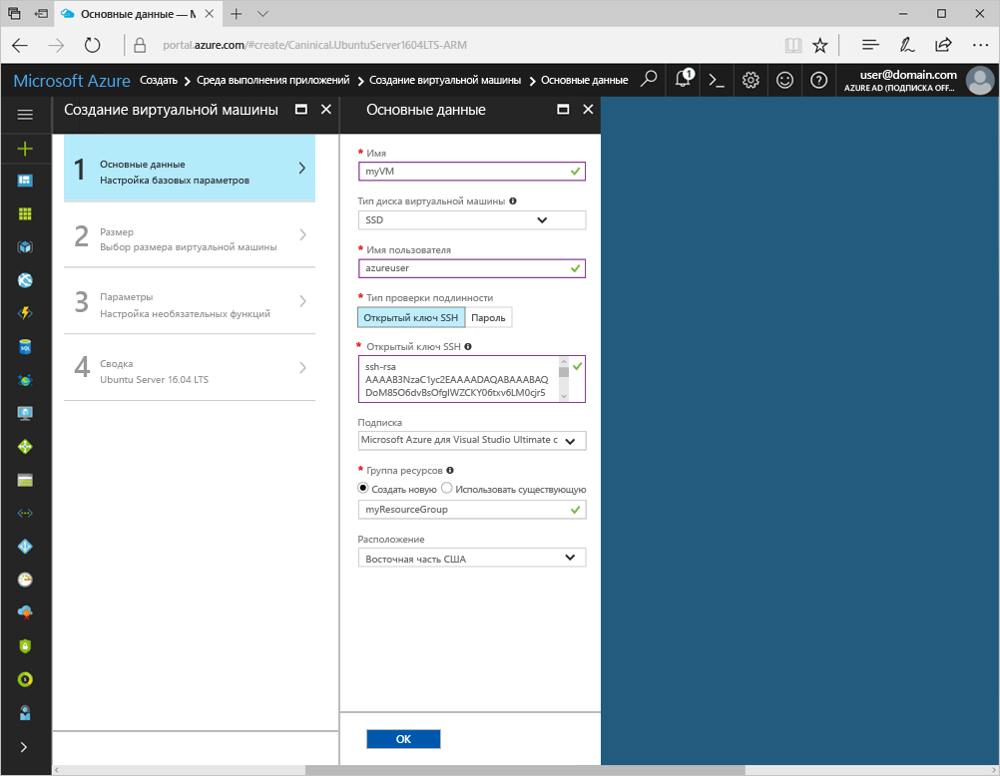
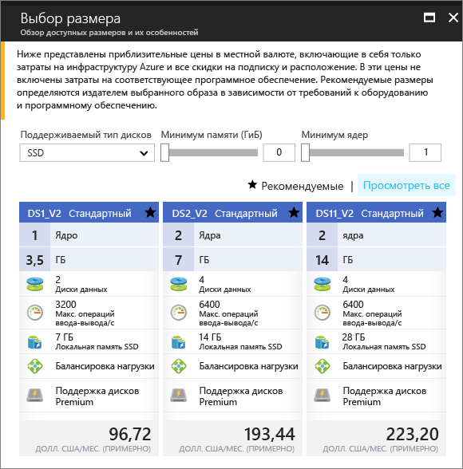
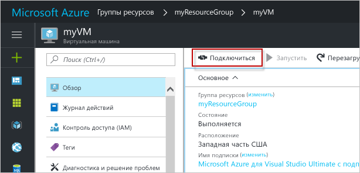

# <a name="create-a-linux-virtual-machine-with-the-azure-portal"></a><span data-ttu-id="ee6df-103">Создание виртуальной машины Linux с помощью портала Azure</span><span class="sxs-lookup"><span data-stu-id="ee6df-103">Create a Linux virtual machine with the Azure portal</span></span>

<span data-ttu-id="ee6df-104">Виртуальные машины Azure можно создать на портале Azure.</span><span class="sxs-lookup"><span data-stu-id="ee6df-104">Azure virtual machines can be created through the Azure portal.</span></span> <span data-ttu-id="ee6df-105">В этом случае для создания и настройки виртуальных машин и всех связанных ресурсов Azure используется пользовательский интерфейс на основе браузера.</span><span class="sxs-lookup"><span data-stu-id="ee6df-105">This method provides a browser-based user interface for creating and configuring virtual machines and all related resources.</span></span> <span data-ttu-id="ee6df-106">В этом кратком руководстве содержатся пошаговые инструкции по созданию виртуальной машины и установке веб-сервера на этой виртуальной машине.</span><span class="sxs-lookup"><span data-stu-id="ee6df-106">This Quickstart steps through creating a virtual machine and installing a webserver on the VM.</span></span>

<span data-ttu-id="ee6df-107">Если у вас еще нет подписки Azure, [создайте бесплатную учетную запись Azure](https://azure.microsoft.com/free/?WT.mc_id=A261C142F) , прежде чем начинать работу.</span><span class="sxs-lookup"><span data-stu-id="ee6df-107">If you don't have an Azure subscription, create a [free account](https://azure.microsoft.com/free/?WT.mc_id=A261C142F) before you begin.</span></span>

## <a name="create-ssh-key-pair"></a><span data-ttu-id="ee6df-108">Создание пары ключей SSH</span><span class="sxs-lookup"><span data-stu-id="ee6df-108">Create SSH key pair</span></span>

<span data-ttu-id="ee6df-109">Для работы с этим руководством по быстрому запуску вам понадобится пара ключей SSH.</span><span class="sxs-lookup"><span data-stu-id="ee6df-109">You need an SSH key pair to complete this quick start.</span></span> <span data-ttu-id="ee6df-110">Если у вас уже есть пара ключей SSH, этот шаг можно пропустить.</span><span class="sxs-lookup"><span data-stu-id="ee6df-110">If you have an existing SSH key pair, this step can be skipped.</span></span>

<span data-ttu-id="ee6df-111">Из оболочки Bash выполните следующую команду, а затем следуйте отображаемым на экране инструкциям.</span><span class="sxs-lookup"><span data-stu-id="ee6df-111">From a Bash shell, run this command and follow the on-screen directions.</span></span> <span data-ttu-id="ee6df-112">Выходные данные команды включают имя файла открытого ключа.</span><span class="sxs-lookup"><span data-stu-id="ee6df-112">The command output includes the file name of the public key file.</span></span> <span data-ttu-id="ee6df-113">Скопируйте содержимое файла открытого ключа в буфер обмена.</span><span class="sxs-lookup"><span data-stu-id="ee6df-113">Copy the contents of the public key file to the clipboard.</span></span>

```bash
ssh-keygen -t rsa -b 2048
```

## <a name="log-in-to-azure"></a><span data-ttu-id="ee6df-114">Вход в Azure</span><span class="sxs-lookup"><span data-stu-id="ee6df-114">Log in to Azure</span></span> 

<span data-ttu-id="ee6df-115">Войдите на портал Azure по адресу http://portal.azure.com.</span><span class="sxs-lookup"><span data-stu-id="ee6df-115">Log in to the Azure portal at http://portal.azure.com.</span></span>

## <a name="create-virtual-machine"></a><span data-ttu-id="ee6df-116">Создание виртуальной машины</span><span class="sxs-lookup"><span data-stu-id="ee6df-116">Create virtual machine</span></span>

1. <span data-ttu-id="ee6df-117">Щелкните **Создать** в верхнем левом углу портала Azure.</span><span class="sxs-lookup"><span data-stu-id="ee6df-117">Click the **New** button found on the upper left-hand corner of the Azure portal.</span></span>

2. <span data-ttu-id="ee6df-118">Выберите **Вычисления**, а затем — **Сервер Ubuntu 16.04 LTS**.</span><span class="sxs-lookup"><span data-stu-id="ee6df-118">Select **Compute**, and then select **Ubuntu Server 16.04 LTS**.</span></span> 

3. <span data-ttu-id="ee6df-119">Введите сведения о виртуальной машине.</span><span class="sxs-lookup"><span data-stu-id="ee6df-119">Enter the virtual machine information.</span></span> <span data-ttu-id="ee6df-120">Для параметра **Тип проверки подлинности** выберите значение **Открытый ключ SSH**.</span><span class="sxs-lookup"><span data-stu-id="ee6df-120">For **Authentication type**, select **SSH public key**.</span></span> <span data-ttu-id="ee6df-121">При вставке открытого ключа SSH обязательно удалите из него начальные и конечные пробелы.</span><span class="sxs-lookup"><span data-stu-id="ee6df-121">When pasting in your SSH public key, take care to remove any leading or trailing white space.</span></span> <span data-ttu-id="ee6df-122">По завершении нажмите кнопку **ОК**.</span><span class="sxs-lookup"><span data-stu-id="ee6df-122">When complete, click **OK**.</span></span>

    

4. <span data-ttu-id="ee6df-124">Выберите размер виртуальной машины.</span><span class="sxs-lookup"><span data-stu-id="ee6df-124">Select a size for the VM.</span></span> <span data-ttu-id="ee6df-125">Чтобы просмотреть дополнительные размеры, выберите **Просмотреть все** или измените фильтр **Supported disk type** (Поддерживаемые типы диска).</span><span class="sxs-lookup"><span data-stu-id="ee6df-125">To see more sizes, select **View all** or change the **Supported disk type** filter.</span></span> 

      

5. <span data-ttu-id="ee6df-127">В колонке параметров оставьте значения по умолчанию и нажмите кнопку **OK**.</span><span class="sxs-lookup"><span data-stu-id="ee6df-127">On the settings blade, keep the defaults and click **OK**.</span></span>

6. <span data-ttu-id="ee6df-128">На странице сводки нажмите кнопку **OК**, чтобы начать развертывание виртуальной машины.</span><span class="sxs-lookup"><span data-stu-id="ee6df-128">On the summary page, click **Ok** to start the virtual machine deployment.</span></span>

7. <span data-ttu-id="ee6df-129">Виртуальная машина будет закреплена на панели мониторинга портала Azure.</span><span class="sxs-lookup"><span data-stu-id="ee6df-129">The VM will be pinned to the Azure portal dashboard.</span></span> <span data-ttu-id="ee6df-130">По завершении развертывания автоматически откроется колонка со сводными сведениями о виртуальной машине.</span><span class="sxs-lookup"><span data-stu-id="ee6df-130">Once the deployment has completed, the VM summary blade automatically opens.</span></span>


## <a name="connect-to-virtual-machine"></a><span data-ttu-id="ee6df-131">Подключение к виртуальной машине</span><span class="sxs-lookup"><span data-stu-id="ee6df-131">Connect to virtual machine</span></span>

<span data-ttu-id="ee6df-132">Создайте SSH-подключение к виртуальной машине.</span><span class="sxs-lookup"><span data-stu-id="ee6df-132">Create an SSH connection with the virtual machine.</span></span>

1. <span data-ttu-id="ee6df-133">Нажмите кнопку **Подключиться** в колонке виртуальной машины.</span><span class="sxs-lookup"><span data-stu-id="ee6df-133">Click the **Connect** button on the virtual machine blade.</span></span> <span data-ttu-id="ee6df-134">Кнопка "Подключение" отображает строку подключения по протоколу SSH, которая может использоваться для подключения к виртуальной машине.</span><span class="sxs-lookup"><span data-stu-id="ee6df-134">The connect button displays an SSH connection string that can be used to connect to the virtual machine.</span></span>

     

2. <span data-ttu-id="ee6df-136">Чтобы создать сеанс SSH, выполните следующую команду.</span><span class="sxs-lookup"><span data-stu-id="ee6df-136">Run the following command to create an SSH session.</span></span> <span data-ttu-id="ee6df-137">Замените строку подключения содержимым строки подключения, скопированным на портале Azure.</span><span class="sxs-lookup"><span data-stu-id="ee6df-137">Replace the connection string with the one you copied from the Azure portal.</span></span>

```bash 
ssh azureuser@40.112.21.50
```

## <a name="install-nginx"></a><span data-ttu-id="ee6df-138">Установка nginx</span><span class="sxs-lookup"><span data-stu-id="ee6df-138">Install NGINX</span></span>

<span data-ttu-id="ee6df-139">Чтобы обновить источники пакетов и установить последнюю версию пакета nginx, используйте следующий bash-скрипт:</span><span class="sxs-lookup"><span data-stu-id="ee6df-139">Use the following bash script to update package sources and install the latest NGINX package.</span></span> 

```bash 
#!/bin/bash

# update package source
sudo apt-get -y update

# install NGINX
sudo apt-get -y install nginx
```

<span data-ttu-id="ee6df-140">После этого завершите сеанс SSH и вернитесь на страницу свойств виртуальной машины на портале Azure.</span><span class="sxs-lookup"><span data-stu-id="ee6df-140">When done, exit the SSH session and return the VM properties in the Azure portal.</span></span>


## <a name="open-port-80-for-web-traffic"></a><span data-ttu-id="ee6df-141">Открытие порта 80 для веб-трафика</span><span class="sxs-lookup"><span data-stu-id="ee6df-141">Open port 80 for web traffic</span></span> 

<span data-ttu-id="ee6df-142">Группа безопасности сети (NSG) защищает входящий и исходящий трафик.</span><span class="sxs-lookup"><span data-stu-id="ee6df-142">A Network security group (NSG) secures inbound and outbound traffic.</span></span> <span data-ttu-id="ee6df-143">При создании виртуальной машины на портале Azure правило для входящего трафика создается через порт 22 для SSH-подключений.</span><span class="sxs-lookup"><span data-stu-id="ee6df-143">When a VM is created from the Azure portal, an inbound rule is created on port 22 for SSH connections.</span></span> <span data-ttu-id="ee6df-144">Так как на этой виртуальной машине размещается веб-сервер, необходимо создать правило NSG для порта 80.</span><span class="sxs-lookup"><span data-stu-id="ee6df-144">Because this VM hosts a webserver, an NSG rule needs to be created for port 80.</span></span>

1. <span data-ttu-id="ee6df-145">На виртуальной машине щелкните имя **группы ресурсов**.</span><span class="sxs-lookup"><span data-stu-id="ee6df-145">On the virtual machine, click the name of the **Resource group**.</span></span>
2. <span data-ttu-id="ee6df-146">Выберите **группу безопасности сети**.</span><span class="sxs-lookup"><span data-stu-id="ee6df-146">Select the **network security group**.</span></span> <span data-ttu-id="ee6df-147">NSG можно определить с помощью столбца **Тип**.</span><span class="sxs-lookup"><span data-stu-id="ee6df-147">The NSG can be identified using the **Type** column.</span></span> 
3. <span data-ttu-id="ee6df-148">В меню слева в разделе параметров щелкните **Правила безопасности для входящего трафика**.</span><span class="sxs-lookup"><span data-stu-id="ee6df-148">On the left-hand menu, under settings, click **Inbound security rules**.</span></span>
4. <span data-ttu-id="ee6df-149">Щелкните **Добавить**.</span><span class="sxs-lookup"><span data-stu-id="ee6df-149">Click on **Add**.</span></span>
5. <span data-ttu-id="ee6df-150">В поле **Имя** введите **http**.</span><span class="sxs-lookup"><span data-stu-id="ee6df-150">In **Name**, type **http**.</span></span> <span data-ttu-id="ee6df-151">Убедитесь, что для параметра **Диапазон портов** задано значение 80, а для параметра **Действие** — значение **Разрешить**.</span><span class="sxs-lookup"><span data-stu-id="ee6df-151">Make sure **Port range** is set to 80 and **Action** is set to **Allow**.</span></span> 
6. <span data-ttu-id="ee6df-152">Нажмите кнопку **ОК**.</span><span class="sxs-lookup"><span data-stu-id="ee6df-152">Click **OK**.</span></span>


## <a name="view-the-nginx-welcome-page"></a><span data-ttu-id="ee6df-153">Просмотр страницы приветствия nginx</span><span class="sxs-lookup"><span data-stu-id="ee6df-153">View the NGINX welcome page</span></span>

<span data-ttu-id="ee6df-154">Установив NGINX и открыв порт 80 для виртуальной машины, вы можете получить доступ к веб-серверу через Интернет.</span><span class="sxs-lookup"><span data-stu-id="ee6df-154">With NGINX installed, and port 80 open to your VM, the webserver can now be accessed from the internet.</span></span> <span data-ttu-id="ee6df-155">Откройте веб-браузер и введите общедоступный IP-адрес виртуальной машины.</span><span class="sxs-lookup"><span data-stu-id="ee6df-155">Open a web browser, and enter the public IP address of the VM.</span></span> <span data-ttu-id="ee6df-156">Общедоступный IP-адрес можно найти в колонке "Виртуальная машина" на портале Azure.</span><span class="sxs-lookup"><span data-stu-id="ee6df-156">The public IP address can be found on the VM blade in the Azure portal.</span></span>

 

## <a name="clean-up-resources"></a><span data-ttu-id="ee6df-158">Очистка ресурсов</span><span class="sxs-lookup"><span data-stu-id="ee6df-158">Clean up resources</span></span>

<span data-ttu-id="ee6df-159">Ставшие ненужными группу ресурсов, виртуальную машину и все связанные ресурсы можно удалить, выполнив следующую команду.</span><span class="sxs-lookup"><span data-stu-id="ee6df-159">When no longer needed, delete the resource group, virtual machine, and all related resources.</span></span> <span data-ttu-id="ee6df-160">Для этого выберите группу ресурсов в колонке виртуальной машины и нажмите кнопку **Удалить**.</span><span class="sxs-lookup"><span data-stu-id="ee6df-160">To do so, select the resource group from the virtual machine blade and click **Delete**.</span></span>

## <a name="next-steps"></a><span data-ttu-id="ee6df-161">Дальнейшие действия</span><span class="sxs-lookup"><span data-stu-id="ee6df-161">Next steps</span></span>

<span data-ttu-id="ee6df-162">Из этого краткого руководства вы узнали о том, как развернуть простую виртуальную машину, о правилах группы безопасности сети и об установке веб-сервера.</span><span class="sxs-lookup"><span data-stu-id="ee6df-162">In this quick start, you’ve deployed a simple virtual machine, a network security group rule, and installed a web server.</span></span> <span data-ttu-id="ee6df-163">Дополнительные сведения о виртуальных машинах Azure см. в руководстве для виртуальных машин Linux.</span><span class="sxs-lookup"><span data-stu-id="ee6df-163">To learn more about Azure virtual machines, continue to the tutorial for Linux VMs.</span></span>

> [!div class="nextstepaction"]
> [<span data-ttu-id="ee6df-164">Создание виртуальных машин Linux и управление ими с помощью Azure CLI</span><span class="sxs-lookup"><span data-stu-id="ee6df-164">Azure Linux virtual machine tutorials</span></span>](./tutorial-manage-vm.md)
