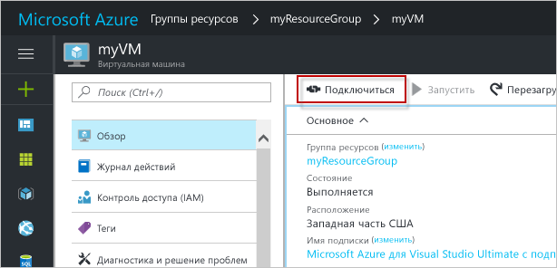

# <a name="create-a-windows-virtual-machine-with-hello-azure-portal"></a>Создание виртуальной машины Windows с hello портал Azure

Виртуальные машины Azure могут создаваться через портал Azure hello. В этом случае для создания и настройки виртуальных машин и всех связанных ресурсов Azure используется пользовательский интерфейс на основе браузера. Это краткое руководство пошаговые инструкции для создания виртуальной машины и установка веб-сервере, на hello виртуальной Машины.

Если у вас еще нет подписки Azure, [создайте бесплатную учетную запись Azure](https://azure.microsoft.com/free/?WT.mc_id=A261C142F), прежде чем начинать работу.

## <a name="log-in-tooazure"></a>Войдите в tooAzure

Войдите в систему toohello портал Azure по адресу http://portal.azure.com.

## <a name="create-virtual-machine"></a>Создание виртуальной машины

1. Нажмите кнопку hello **New** кнопка найдена в верхнем левом углу hello hello портал Azure.

2. Выберите **Вычисления**, а затем — **Windows Server 2016 Datacenter**. 

3. Введите сведения о виртуальной машине hello. Hello имя пользователя и пароль, введенный здесь — используется toolog toohello виртуальной машине. По завершении нажмите кнопку **ОК**.

      

4. Выберите размер виртуальной Машины hello. Выберите дополнительные размеры toosee **просмотреть все** или изменить hello **поддерживается тип диска** фильтра. 

      

5. В колонке параметров hello, оставьте значения по умолчанию hello и нажмите кнопку **ОК**.

6. На странице сводки hello щелкните **ОК** развертывания виртуальной машины toostart hello.

7. Hello виртуальной Машины будет закрепленных toohello Azure панели мониторинга портала. После завершения развертывания hello, автоматически откроется Сводка колонки hello виртуальной Машины.


## <a name="connect-toovirtual-machine"></a>Подключиться к компьютеру toovirtual

Создание виртуальной машины toohello подключения удаленного рабочего стола.

1. Нажмите кнопку hello **Connect** кнопку на hello свойства виртуальной машины. Будет создан и скачан файл протокола удаленного рабочего стола (RDP-файл).

     

2. tooconnect tooyour виртуальной Машины, откройте hello загрузить RDP-файл. При появлении запроса нажмите кнопку **Подключиться**. На компьютере Mac, необходимо клиентом RDP, такие как это [клиент удаленного рабочего стола](https://itunes.apple.com/us/app/microsoft-remote-desktop/id715768417?mt=12) из hello Mac App Store.

3. Введите hello имя пользователя и пароль, указанный при создании hello виртуальную машину, затем щелкните **ОК**.

4. Может появиться предупреждение сертификата во время процесса входа hello. Нажмите кнопку **Да** или **Продолжить** tooproceed с подключением hello.


## <a name="install-iis-using-powershell"></a>Установка IIS с помощью PowerShell

На виртуальной машине hello запустите сеанс PowerShell и выполните hello, следующая команда tooinstall IIS.

```powershell
Install-WindowsFeature -name Web-Server -IncludeManagementTools
```

После этого завершите сеанс RDP hello и возвращает свойства виртуальной Машины hello hello портал Azure.

## <a name="open-port-80-for-web-traffic"></a>Открытие порта 80 для веб-трафика 

Группа безопасности сети (NSG) защищает входящий и исходящий трафик. При создании виртуальной Машины из портала Azure hello входящее правило создается на порт 3389 для подключений по протоколу RDP. Поскольку эта виртуальная машина размещается веб-сервере, правило NSG должен toobe, созданное для порта 80.

1. На виртуальной машине hello, щелкните имя hello hello **группы ресурсов**.
2. Выберите hello **сетевой группы безопасности**. Hello NSG можно определить с помощью hello **тип** столбца. 
3. Hello слева в разделе Параметры меню **безопасности правила для входящих подключений**.
4. Щелкните **Добавить**.
5. В поле **Имя** введите **http**. Убедитесь, что **диапазон портов** задано too80 и **действия** задано слишком**Разрешить**. 
6. Нажмите кнопку **ОК**.


## <a name="view-hello-iis-welcome-page"></a>Представление hello страницу приветствия IIS

Со службами IIS установлены и порт 80 откройте tooyour виртуальных Машин, веб-сервер hello, теперь доступны из hello Интернета. Откройте веб-браузер и введите hello общедоступный IP-адрес hello виртуальной Машины. Hello общедоступный IP-адрес можно найти на колонки виртуальной Машины hello в hello портал Azure.

 

## <a name="clean-up-resources"></a>Очистка ресурсов

Когда больше не нужен, удалите hello группы ресурсов, виртуальные машины и все связанные ресурсы. toodo таким образом, выберите группу ресурсов hello hello колонке виртуальной машины и нажмите кнопку **удалить**.

## <a name="next-steps"></a>Дальнейшие действия

Из этого краткого руководства вы узнали о том, как развернуть простую виртуальную машину, о правилах группы безопасности сети и об установке веб-сервера. toolearn Дополнительные сведения о виртуальных машинах Azure, продолжить toohello учебника для виртуальных машин Windows.

> [!div class="nextstepaction"]
> [Создание виртуальных машин Windows и управление ими с помощью модуля Azure PowerShell](./tutorial-manage-vm.md)
