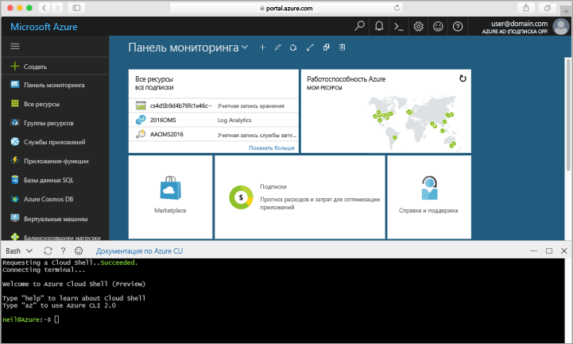

## Запуск Azure Cloud ShellLaunch Azure Cloud Shell

Hello оболочки облако Azure — это бесплатные Bash, который выполняется непосредственно в hello портал Azure.hello Azure Cloud Shell is a free Bash shell that you can run directly within hello Azure portal. Он имеет hello Azure CLI предварительно установить и настроить toouse с вашей учетной записью.It has hello Azure CLI preinstalled and configured toouse with your account. Щелкните hello **оболочки облака** кнопку меню hello в верхнем правом hello объекта hello [портал Azure](https://portal.azure.com).Click hello **Cloud Shell** button on hello menu in hello upper-right of hello [Azure portal](https://portal.azure.com).

Hello запускает оболочкой интерактивной, можно использовать toorun hello все шаги в этом разделе:hello button launches an interactive shell that you can use toorun all of hello steps in this topic:

