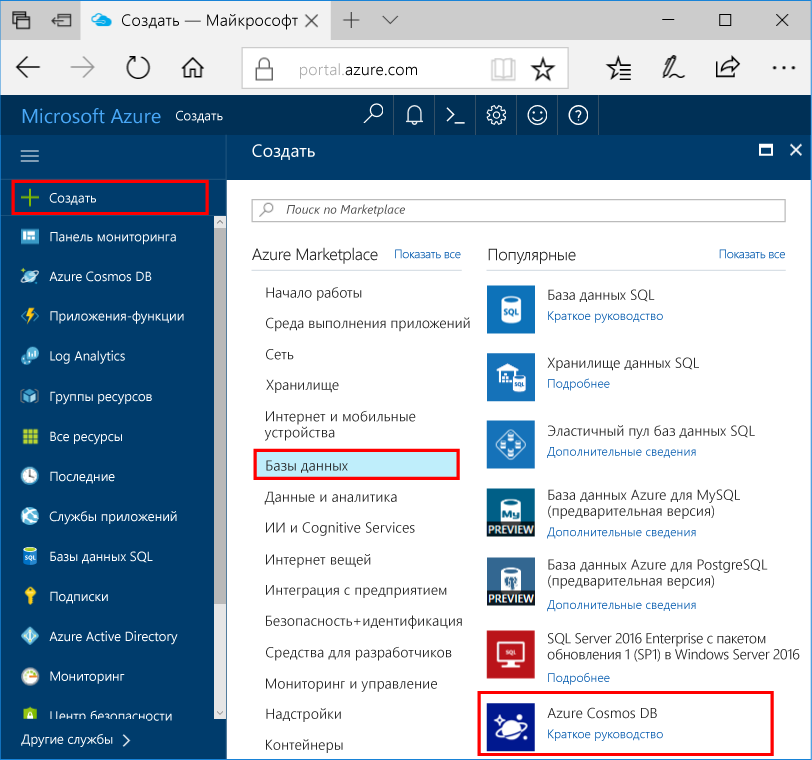
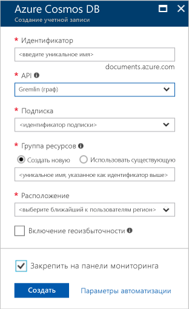

1. В новом окне Вход toohello [портал Azure](https://portal.azure.com/).In a new window, sign in toohello [Azure portal](https://portal.azure.com/).
2. Hello левой панели щелкните **New**, нажмите кнопку **баз данных**, а затем в разделе **Azure Cosmos DB**, нажмите кнопку **создать**.In hello left pane, click **New**, click **Databases**, and then under **Azure Cosmos DB**, click **Create**.
   
   

3. В hello **новой учетной записи** колонке укажите конфигурацию для этой учетной записи Azure Cosmos DB hello.In hello **New account** blade, specify hello configuration that you want for this Azure Cosmos DB account. 

    C помощью Azure Cosmos DB можно выбрать одну из четырех моделей программирования: Gremlin (граф), MongoDB, SQL (DocumentDB) или таблицу (ключ — значение). Сейчас для каждой модели требуется отдельная учетная запись.With Azure Cosmos DB, you can choose one of four programming models: Gremlin (graph), MongoDB, SQL (DocumentDB), and Table (key-value), each which currently require a separate account.
       
    В этой статье Краткое мы используем при программировании hello Graph API, выберите **Gremlin (график)** после заполнения формы hello.In this quick-start article, we program against hello Graph API, so choose **Gremlin (graph)** as you fill out hello form. При наличии данных документа из приложения каталога, данных таблицы или данных типа "ключ — значение", а также данных, перенесенных из приложения MongoDB, учтите, что Azure Cosmos DB может предоставить высокодоступную глобально распределенную платформу службы базы данных для всех критически важных приложений.If you have document data from a catalog app, key/value (table) data, or data that's migrated from a MongoDB app, realize that Azure Cosmos DB can provide a highly available, globally distributed database service platform for all your mission-critical applications.

    Заполните поля hello на hello **новой учетной записи** колонки, используя сведения о hello в hello следующий снимок экрана по - значения могут отличаться от значений hello на снимке экрана приветствия.Complete hello fields on hello **New account** blade, using hello information in hello following screenshot as a guide - your values may be different than hello values in hello screenshot.
 
    

    НастройкаSetting|Рекомендуемое значениеSuggested value|ОписаниеDescription
    ---|---|---
    ИДID|*Уникальное значение**Unique value*|Уникальное имя, идентифицирующее эту учетную запись Azure Cosmos DB.A unique name that identifies this Azure Cosmos DB account. Поскольку *documents.azure.com* — присоединенных toohello идентификатор предоставляют toocreate URI, используйте уникальный, но данные по идентификатору.Because *documents.azure.com* is appended toohello ID that you provide toocreate your URI, use a unique but identifiable ID. Идентификатор Hello должен содержать только строчные буквы, цифры и знак дефиса (-) hello и он должен содержать от 3 too50 символов.hello ID must contain only lowercase letters, numbers, and hello hyphen (-) character, and it must contain from 3 too50 characters.
    APIAPI|Gremlin (граф)Gremlin (graph)|Мы используем при программировании hello [Graph API](../articles/cosmos-db/graph-introduction.md) далее в этой статье.We program against hello [Graph API](../articles/cosmos-db/graph-introduction.md) later in this article.|
    ПодпискиSubscription|*Ваша подписка**Your subscription*|Здравствуйте, подписки Azure, что требуется toouse для этой учетной записи Azure Cosmos DB.hello Azure subscription that you want toouse for this Azure Cosmos DB account. 
    Группа ресурсовResource Group|*совпадает со значением в идентификатор Hello**hello same value as ID*|Hello новое имя группы ресурсов для вашей учетной записи.hello new resource group name for your account. Для простоты можно использовать hello точно такое же имя в качестве свой идентификатор.For simplicity, you can use hello same name as your ID. 
    РасположениеLocation|*Пользователи tooyour ближайший регион Hello**hello region closest tooyour users*|Здравствуйте, географическим местоположением, в которой toohost учетной записи Azure Cosmos DB.hello geographic location in which toohost your Azure Cosmos DB account. Выберите расположение hello ближайший пользователей tooyour toogive их hello быстрый доступ к данным toohello.Choose hello location closest tooyour users toogive them hello fastest access toohello data.

4. Нажмите кнопку **создать** учетной записи toocreate hello.Click **Create** toocreate hello account.
5. На верхней панели инструментов hello щелкните hello **уведомления** значок  процесс развертывания toomonitor hello.On hello top toolbar, click hello **Notifications** icon  toomonitor hello deployment process.

    

6.  Когда окно уведомления hello указывает окно уведомления выполнена успешно, закройте hello развертывания hello и Привет открыть новую учетную запись из hello **все ресурсы** плитки на панели мониторинга hello.When hello Notifications window indicates hello deployment succeeded, close hello notification window and open hello new account from hello **All Resources** tile on hello Dashboard. 

    
