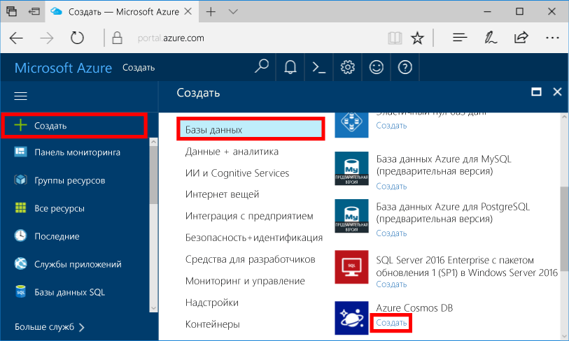
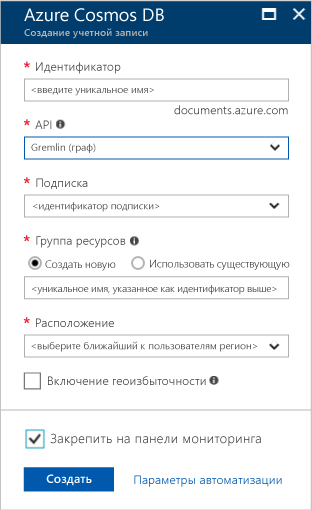
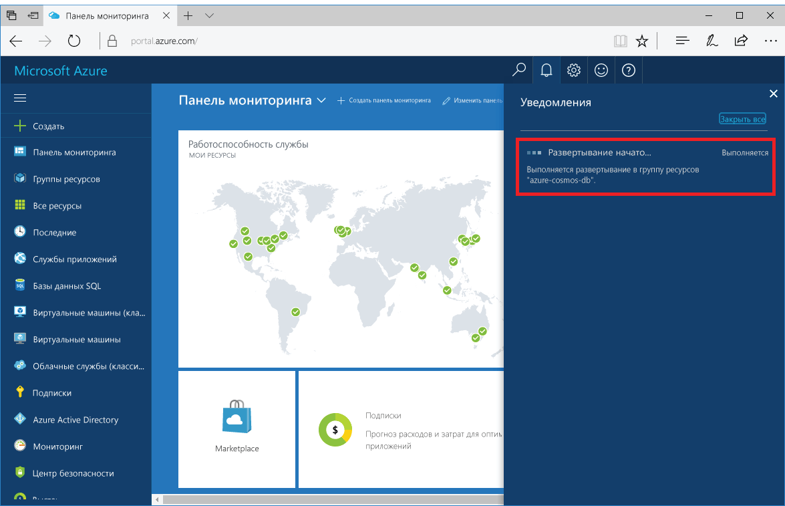
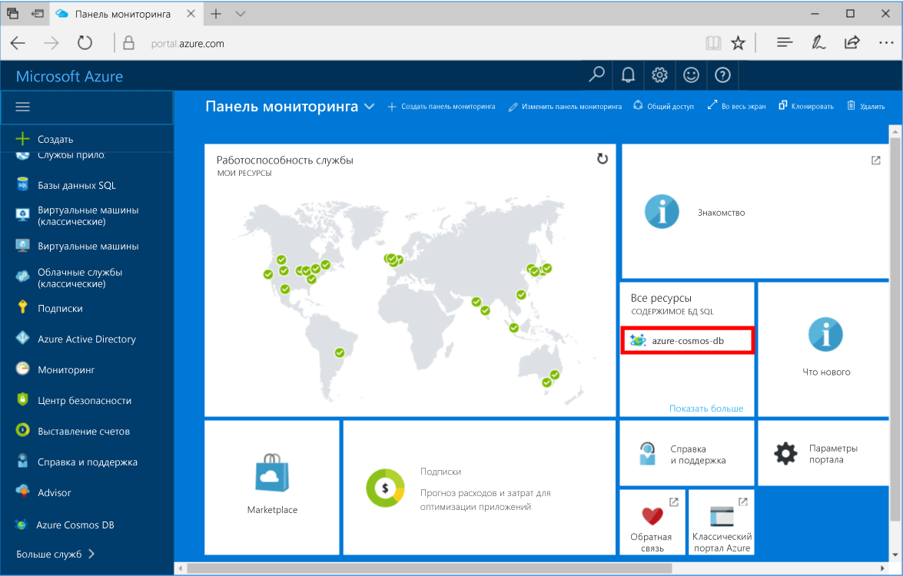

1. В новом окне Вход toohello [портал Azure](https://portal.azure.com/).In a new window, sign in toohello [Azure portal](https://portal.azure.com/).
2. В левом меню hello, нажмите кнопку **New**, нажмите кнопку **баз данных**, а затем в разделе **Azure Cosmos DB**, нажмите кнопку **создать**.In hello left menu, click **New**, click **Databases**, and then under **Azure Cosmos DB**, click **Create**.
   
   

3. В hello **новой учетной записи** колонки, укажите нужную конфигурацию hello hello Azure Cosmos DB учетной записи.In hello **New account** blade, specify hello desired configuration for hello Azure Cosmos DB account. 

    C помощью Azure Cosmos DB можно выбрать одну из четырех моделей программирования: Gremlin (граф), MongoDB, SQL (DocumentDB) и таблица (ключ — значение).With Azure Cosmos DB, you can choose one of four programming models: Gremlin (graph), MongoDB, SQL (DocumentDB), and Table (key-value). 
       
    В этом кратком руководстве мы будем программирование hello MongoDB API, вам нужно будет выбрать **MongoDB** после заполнения формы hello.In this quick start we'll be programming against hello MongoDB API so you'll choose **MongoDB** as you fill out hello form. Но при наличии данных графа для приложения в социальных сетях, данных документа из приложения каталога, данных таблицы или данных типа "ключ — значение", учтите, что Azure Cosmos DB может предоставить высокодоступную глобально распределенную платформу службы базы данных для всех критически важных приложений.But if you have graph data for a social media app, document data from a catalog app, or key/value (table) data, realize that Azure Cosmos DB can provide a highly available, globally-distributed database service platform for all your mission-critical applications.

    Заполните hello **новой учетной записи** колонки, руководствуясь hello сведения в таблице hello.Fill out hello **New account** blade using hello information in hello table as a guide.
 
    
   
    НастройкаSetting|Рекомендуемое значениеSuggested value|ОписаниеDescription
    ---|---|---
    ИДID|*Уникальное значение**Unique value*|Уникальное имя вы выбрали tooidentify hello Azure Cosmos DB учетную запись.A unique name you choose tooidentify hello Azure Cosmos DB account. *Documents.Azure.com* — идентификатор присоединенных toohello предоставляют toocreate URI, поэтому следует использовать идентификатор уникальны, но личности пользователя.*documents.azure.com* is appended toohello ID you provide toocreate your URI, so use a unique but identifiable ID. Идентификатор Hello может содержать только строчные буквы, цифры и hello '-' символов и должно содержать от 3 до 50 символов.hello ID may contain only lowercase letters, numbers, and hello '-' character, and must be between 3 and 50 characters.
    APIAPI|MongoDBMongoDB|Мы будем программировании hello [MongoDB API](../articles/documentdb/documentdb-protocol-mongodb.md) далее в этой статье.We'll be programming against hello [MongoDB API](../articles/documentdb/documentdb-protocol-mongodb.md) later in this article.|
    ПодпискиSubscription|*Ваша подписка**Your subscription*|Здравствуйте, подписки Azure, что требуется toouse для учетной записи Azure Cosmos DB hello.hello Azure subscription that you want toouse for hello Azure Cosmos DB account. 
    Группа ресурсовResource Group|*совпадает со значением в идентификатор Hello**hello same value as ID*|Hello новое имя группы ресурсов для вашей учетной записи.hello new resource group name for your account. Для простоты можно использовать hello точно такое же имя в качестве свой идентификатор.For simplicity, you can use hello same name as your ID. 
    РасположениеLocation|*Пользователи tooyour ближайший регион Hello**hello region closest tooyour users*|Здравствуйте, географическим местоположением, в которой toohost учетной записи Azure Cosmos DB.hello geographic location in which toohost your Azure Cosmos DB account. Выберите расположение hello ближайший пользователей tooyour toogive их hello быстрый доступ к данным toohello.Choose hello location closest tooyour users toogive them hello fastest access toohello data.

4. Нажмите кнопку **создать** учетной записи toocreate hello.Click **Create** toocreate hello account.
5. На панели инструментов hello, нажмите кнопку **уведомления** процесс развертывания toomonitor hello.On hello toolbar, click **Notifications** toomonitor hello deployment process.

    

6.  После завершения развертывания hello Привет открыть новую учетную запись из hello все ресурсы плитки.When hello deployment is complete, open hello new account from hello All Resources tile. 

    
