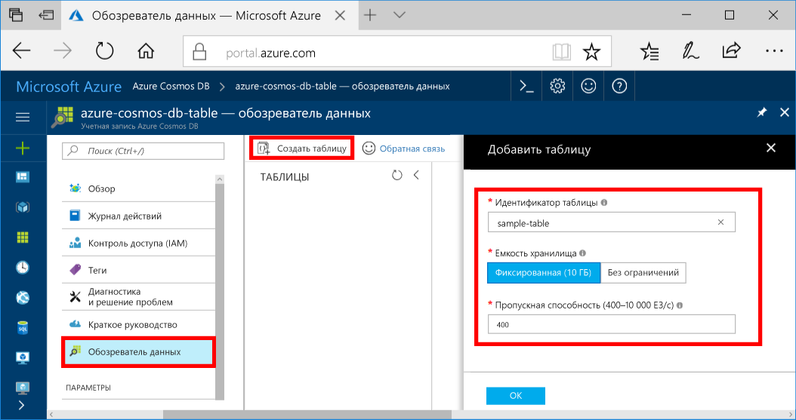

Теперь можно использовать обозреватель данных toocreate таблицу и добавьте tooyour базу данных.You can now use Data Explorer toocreate a table and add data tooyour database. 

1. В hello в меню навигации hello портале Azure щелкните **обозреватель данных (Предварительная версия)**.In hello Azure portal, in hello navigation menu, click **Data Explorer (Preview)**. 
2. В колонке hello обозреватель данных, нажмите кнопку **новую таблицу**, затем заполните страницу приветствия, используя hello следующую информацию.In hello Data Explorer blade, click **New Table**, then fill in hello page using hello following information.

    

    НастройкаSetting|Рекомендуемое значениеSuggested value|ОписаниеDescription
    ---|---|---
    Идентификатор таблицыTable Id|Пример таблицыsample-table|Идентификатор Hello новой таблицы.hello ID for your new table. Имена таблиц имеют hello требования же символов как идентификаторы базы данных.Table names have hello same character requirements as database ids. Имя базы данных может иметь длину от 1 до 255 символов и не может содержать `/ \ # ?` или пробел.Database names must be between 1 and 255 characters, and cannot contain `/ \ # ?` or a trailing space.
    Емкость хранилищаStorage capacity| 10 ГБ10 GB|Оставьте значение по умолчанию hello.Leave hello default value. Это объем памяти hello hello базы данных.This is hello storage capacity of hello database.
    Пропускная способностьThroughput|400 ЕЗ400 RUs|Оставьте значение по умолчанию hello.Leave hello default value. Можно увеличивать масштаб hello [пропускной способности](../articles/cosmos-db/request-units.md) более поздней версии, если требуется, чтобы tooreduce задержки.You can scale up hello [throughput](../articles/cosmos-db/request-units.md) later if you want tooreduce latency.

3. После заполнения формы hello, нажмите кнопку **ОК**.Once hello form is filled out, click **OK**.
