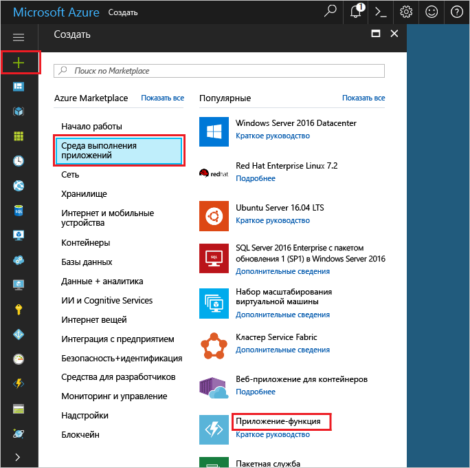

1. Щелкните **Создать** в верхнем левом углу портала Azure.Click the **New** button found on the upper left-hand corner of the Azure portal.

1. Щелкните **Вычисления** > **Приложение-функция**, выберите **Подписка**.Click **Compute** > **Function App**, select your **Subscription**. Затем используйте настройки приложения-функции, указанные в таблице.Then, use the function app settings as specified in the table.

    

    | НастройкаSetting      | Рекомендуемое значениеSuggested value  | ОписаниеDescription                                        |
    | ------------ |  ------- | -------------------------------------------------- |
    | **Имя приложения****App name** | Глобально уникальное имяGlobally unique name | Имя, которое идентифицирует ваше новое приложение-функцию.Name that identifies your new function app. | 
    | **[Группа ресурсов](../articles/azure-resource-manager/resource-group-overview.md)****[Resource Group](../articles/azure-resource-manager/resource-group-overview.md)** |  myResourceGroupmyResourceGroup | Имя новой группы ресурсов, в которой создается приложение-функция.Name for the new resource group in which to create your function app. | 
    | **[План размещения](../articles/azure-functions/functions-scale.md)****[Hosting plan](../articles/azure-functions/functions-scale.md)** |   План потребленияConsumption plan | План размещения, который определяет выделение ресурсов в приложении-функции.Hosting plan that defines how resources are allocated to your function app. В **плане потребления** по умолчанию ресурсы добавляются динамически в соответствии с потребностями функций.In the default **Consumption Plan**, resources are added dynamically as required by your functions. Вы платите только за время выполнения функций.You only pay for the time your functions run.   |
    | **Расположение****Location** | Западная ЕвропаWest Europe | Выберите ближайшее расположение или расположение рядом с другими службами, к которому будут получать доступ ваши функции.Choose a location near you or near other services your functions will access. |
    | **[Учетная запись хранения](../articles/storage/common/storage-create-storage-account.md#create-a-storage-account)****[Storage account](../articles/storage/common/storage-create-storage-account.md#create-a-storage-account)** |  Глобально уникальное имяGlobally unique name |  Имя учетной записи хранения, используемой вашим приложением-функцией.Name of the new storage account used by your function app. Имя учетной записи хранения должно содержать от 3 до 24 символов и состоять только из цифр и строчных букв.Storage account names must be between 3 and 24 characters in length and may contain numbers and lowercase letters only. Вы также можете использовать имеющуюся учетную запись.You can also use an existing account. |

1. Щелкните **Создать** , чтобы подготовить и развернуть новое приложение-функцию.Click **Create** to provision and deploy the new function app.