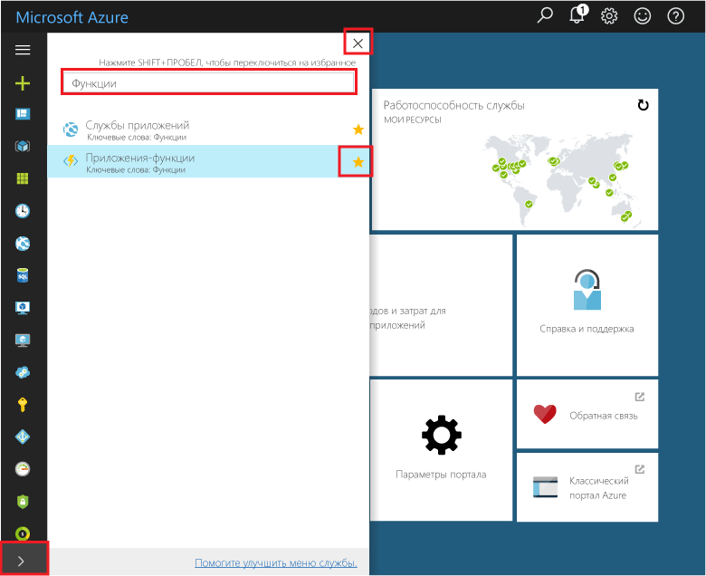
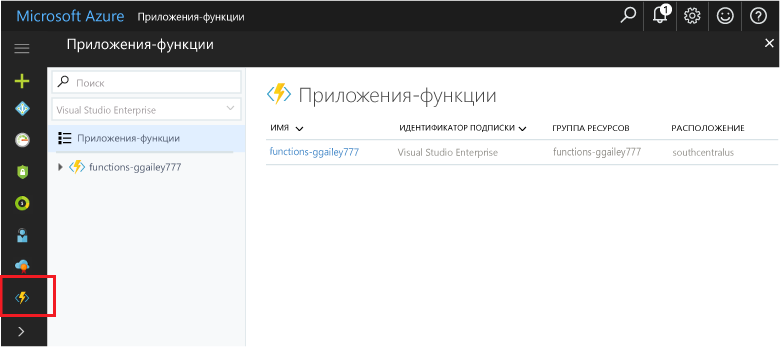

## Добавление приложений-функций, портала tooyour "Избранное" 

Если это еще не сделано, добавьте Избранное tooyour приложений-функций в hello портал Azure. Это позволяет упростить toofind приложений-функций. Если вы уже выполнили это, пропустите следующий раздел toohello. 

1. Войдите в toohello [портал Azure](https://portal.azure.com/).

2. Нажмите кнопку со стрелкой hello в hello нижней, левой tooexpand все службы, тип `Functions` в hello **фильтра** и нажмите кнопку hello звездочка рядом слишком**приложений-функций**.  
 
    

    Это добавляет значок toohello hello функции меню hello левой части портала hello.

3. Закрыть меню hello, а затем прокрутите список вниз toohello нижней toosee hello функции значок. Щелкните этот значок toosee список всех ваших приложениях функции. Щелкните ваш toowork приложения функции с помощью функций в этом приложении. 
 
    
 
     