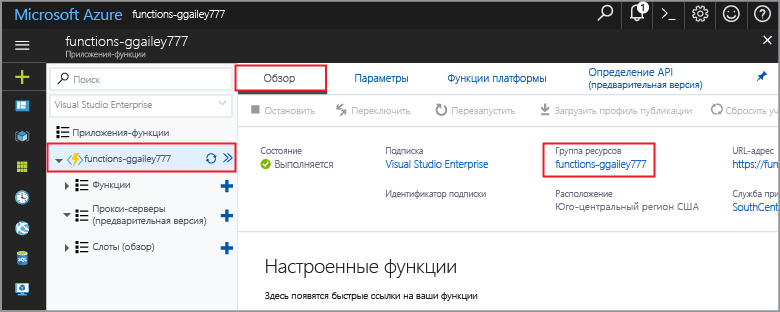

Другие краткие руководства в этой коллекции созданы на основе этого документа.Other quick starts in this collection build upon this quick start. Если планируется toocontinue toowork с последующей краткие или hello учебники, не очистки hello ресурсы, созданные в этом быстрого запускаются.If you plan toocontinue on toowork with subsequent quick starts or with hello tutorials, do not clean up hello resources created in this quick start. 

Если вы не планируете toocontinue, нажмите кнопку hello **группы ресурсов** для приложения hello функции hello портале, и нажмите кнопку **удалить**.If you do not plan toocontinue, click hello **Resource group** for hello function app in hello portal, and then click **Delete**. 

