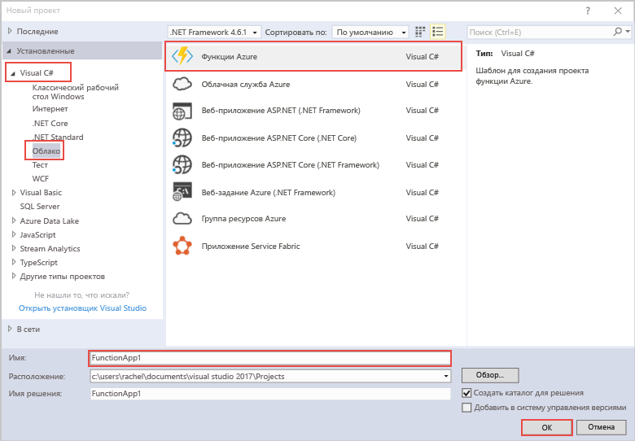

шаблон проекта Azure функции Hello в Visual Studio создает проект, который может быть tooa опубликованные функции приложения в Azure. позволяющее группировать функции в логические единицы и упростить развертывание и совместное использование ресурсов, а также управление ими.   

1. Щелкните правой кнопкой мыши узел проекта hello в **обозревателе решений**, затем выберите **добавить** > **новый элемент**. Выберите **функция Azure** из диалоговое окно «hello».

2. В hello **новый проект** диалогового окна разверните **Visual C#** > **облака** выберите **функции Azure**, введите **Имя** для проекта и нажмите кнопку **ОК**. Имя приложения Hello функции должно быть недопустим в качестве имен C#, поэтому не используйте символы подчеркивания, дефисы и другие символы. 

    
