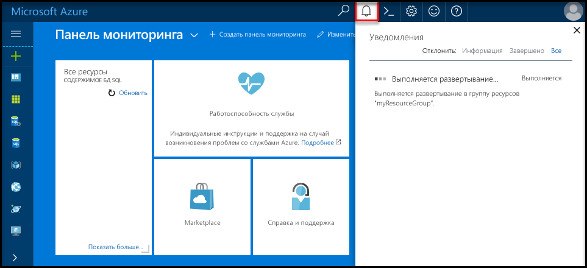
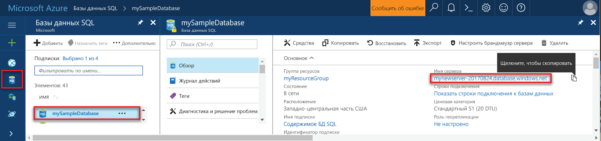

## Войдите в toohello портал Azure

Войдите в toohello [портал Azure](https://portal.azure.com/).

## Создайте пустую базу данных SQL с помощью портала Azure hello

База данных Azure SQL создается с определенным набором [вычислительных ресурсов и ресурсов хранения](../articles/sql-database/sql-database-service-tiers.md). Hello база данных создается в пределах [группы ресурсов Azure](../articles/azure-resource-manager/resource-group-overview.md) и [логический сервер базы данных SQL Azure](../articles/sql-database/sql-database-features.md). 

Выполните эти шаги toocreate пустую базу данных SQL. 

1. Нажмите кнопку hello **New** кнопка найдена в верхнем левом углу hello hello портал Azure.

2. Выберите **баз данных** из hello **New** и выберите **базы данных SQL** из hello **баз данных** страницы. 

   

3. Заполнение hello базы данных SQL формы с hello следующую информацию, как показано на hello предшествующий образа:   

   | Настройка | Рекомендуемое значение | Описание |
   | --------| --------------- | ----------- | 
   | **Database name** (Имя базы данных) | mySampleDatabase | Допустимые имена баз данных см. в статье об [идентификаторах базы данных](https://docs.microsoft.com/sql/relational-databases/databases/database-identifiers). | 
   | **Подписка** | Ваша подписка  | Дополнительные сведения о подписках см. [здесь](https://account.windowsazure.com/Subscriptions). |
   | **Группа ресурсов** | myResourceGroup | Допустимые имена групп ресурсов см. в статье о [правилах и ограничениях именования](https://docs.microsoft.com/azure/architecture/best-practices/naming-conventions). |
   | **Выбрать источник** | Пустая база данных | Указывает, что должна быть создана пустая база данных. |
   ||||

4. Нажмите кнопку **сервера** toocreate и настроить новый сервер для новой базы данных. Заполните hello **новую форму сервера** с hello следующую информацию: 

   | Настройка | Рекомендуемое значение | Описание |
   | --------| --------------- | ----------- | 
   | **Server name** (Имя сервера) | Любое глобально уникальное имя | Допустимые имена серверов см. в статье о [правилах и ограничениях именования](https://docs.microsoft.com/azure/architecture/best-practices/naming-conventions). | 
   | **Имя для входа администратора сервера** | Любое допустимое имя | Допустимые имена входа см. в статье об [идентификаторах базы данных](https://docs.microsoft.com/sql/relational-databases/databases/database-identifiers).|
   | **Пароль** | Любой допустимый пароль | Пароль должен состоять минимум из восьми символов и должен содержать символы трех из следующих категорий hello: буквы в верхнем регистре, буквы в нижнем регистре, цифры и не буквенно-цифровых символов. |
   | **Расположение** | Любое допустимое расположение | Дополнительные сведения о регионах Azure см. [здесь](https://azure.microsoft.com/regions/). |
   ||||

   

5. Нажмите кнопку **Выбрать**.

6. Нажмите кнопку **Ценовая категория** toospecify hello службы уровня и уровня производительности для новой базы данных. Для этого руководства выберите значения **20 DTU** и **250** ГБ хранилища.

   

7. Нажмите кнопку **Применить**.  

8. Выберите **сортировки** для hello пустой базы данных (в этом учебнике используется значение по умолчанию hello). Дополнительные сведения о параметрах сортировки см. в [этой статье](https://docs.microsoft.com/sql/t-sql/statements/collations).

9. Нажмите кнопку **создать** базы данных tooprovision hello. Подготовка занимает около минуты с половиной toocomplete. 

10. На панели инструментов hello, нажмите кнопку **уведомления** процесс развертывания toomonitor hello.

   

## Создание правила брандмауэра на уровне сервера с помощью портала Azure hello

Hello служба базы данных SQL создает брандмауэра на уровне сервера hello. Изначально брандмауэр hello не внешних средствах и подключение toohello сервера или базы данных tooany на сервере hello приложений. После создания правила брандмауэра tooopen определенных IP-адресов, разрешены соединения. Выполните эти действия toocreate [правила брандмауэра уровня сервера базы данных SQL](../articles/sql-database/sql-database-firewall-configure.md) для IP-адрес вашего клиента и tooenable внешнее подключение через брандмауэр hello базы данных SQL для IP-адреса. 

> [!NOTE]
> База данных SQL обменивается данными через порт 1433. TooSQL базы данных можно подключить только после hello брандмауэра сети разрешен исходящий трафик через порт 1433.

1. После завершения развертывания hello, нажмите кнопку **баз данных SQL** hello левого меню и выберите **mySampleDatabase** на hello **баз данных SQL** страницы. Hello страница общих сведений для вашей базы данных открывается, показывающая вы полностью hello доменное имя сервера (таких как **mynewserver20170313.database.windows.net**) и предоставляет параметры для дальнейшей настройки. Скопируйте полное имя сервера для использования в дальнейшем.

   > [!IMPORTANT]
   > Необходимо это полное имя tooconnect tooyour сервера и баз данных в последующих краткие руководства.
   > 

    

2. Нажмите кнопку **установить брандмауэр сервера** на hello инструментов, как показано на предыдущем рисунке hello. Hello **параметры брандмауэра** откроется страница приветствия базы данных SQL server. 

    

3. Нажмите кнопку **добавить IP-адрес клиента** на панели инструментов tooadd hello ваш текущий IP-адрес tooa нового правила брандмауэра. С использованием правила брандмауэра можно открыть порт 1433 для одного IP-адреса или диапазона IP-адресов.

4. Щелкните **Сохранить**. Для открытия порта 1433 на логическом сервере hello текущий IP-адрес создается правило брандмауэра уровня сервера.

    

4. Нажмите кнопку **ОК** , а затем закройте hello **параметры брандмауэра** страницы.

Сервер базы данных SQL Azure toohello и его базы данных теперь можно подключиться с помощью средства, такие как SQL Server Management Studio (SSMS). Hello соединение с этого IP-адреса, и используется учетная запись администратора сервера hello создали ранее.

> [!IMPORTANT]
> По умолчанию доступ через брандмауэр базы данных SQL hello включен для всех служб Azure. Нажмите кнопку **OFF** на этой странице toodisable для всех служб Azure.

## Получение значений строки подключения с помощью портала Azure hello

Получите hello полное имя сервера для сервера базы данных SQL Azure в hello портал Azure. Можно использовать hello полное имя tooconnect tooyour сервер с помощью SQL Server Management Studio.

1. Войдите в toohello [портал Azure](https://portal.azure.com/).

2. Выберите **баз данных SQL** hello левом меню и выберите базу данных на hello **баз данных SQL** страницы. 

3. В hello **Essentials** панели hello странице портала Azure для базы данных, найдите и сохраните hello **имя сервера**.

    
